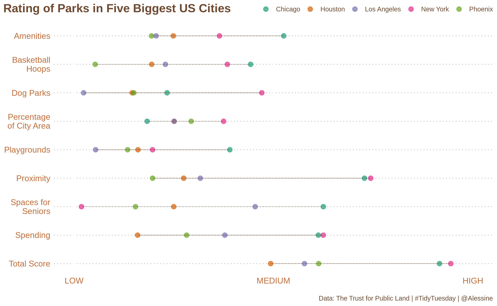
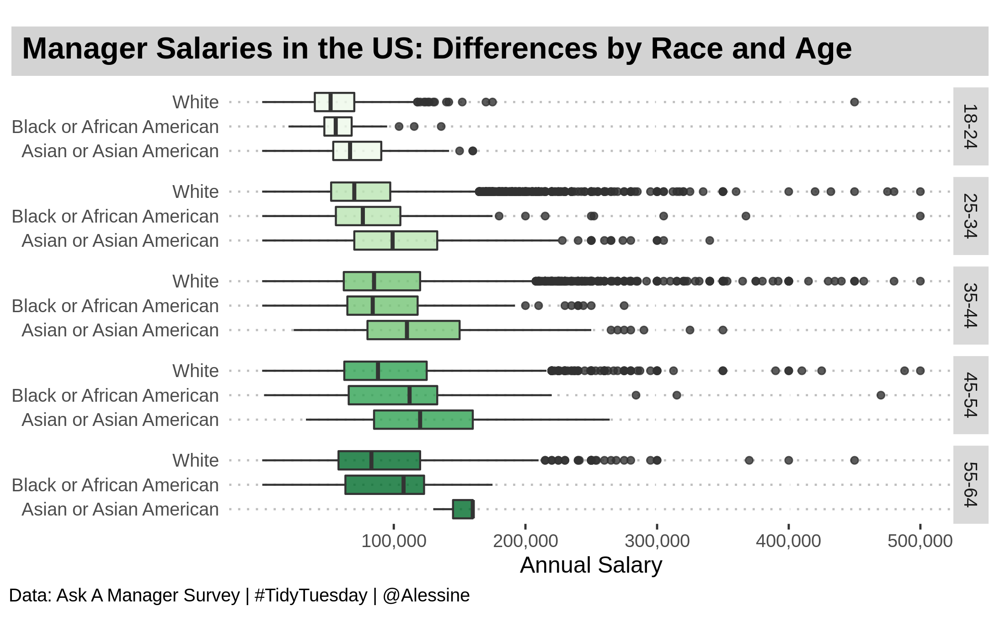
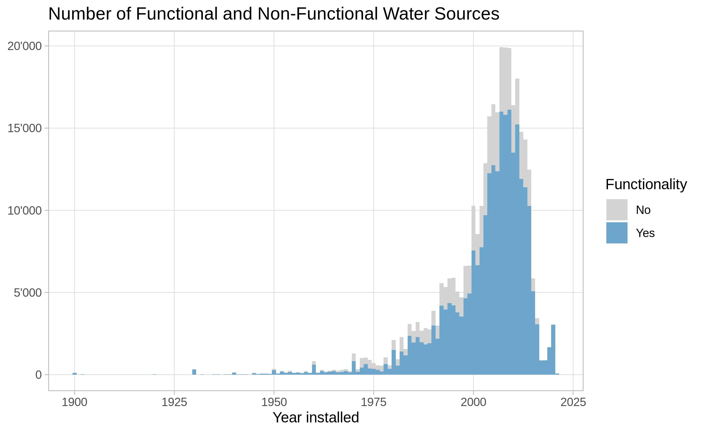
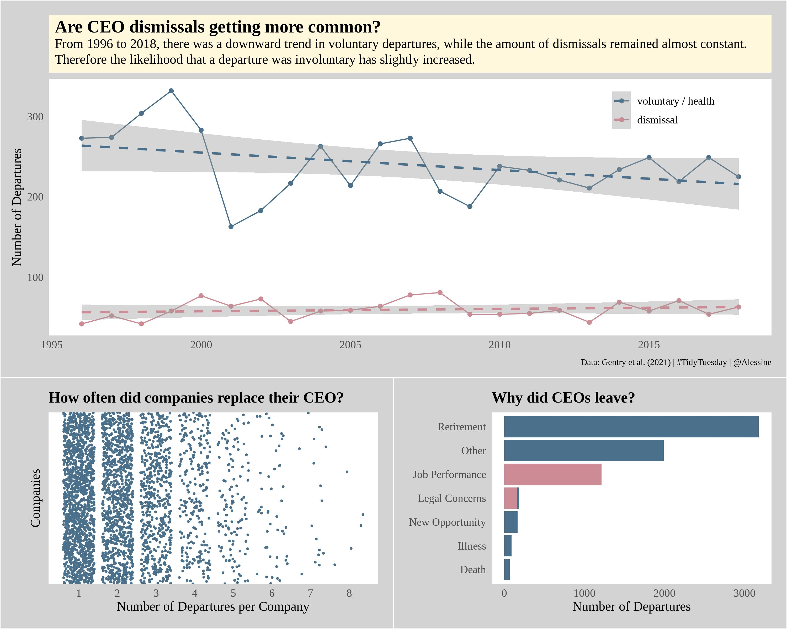
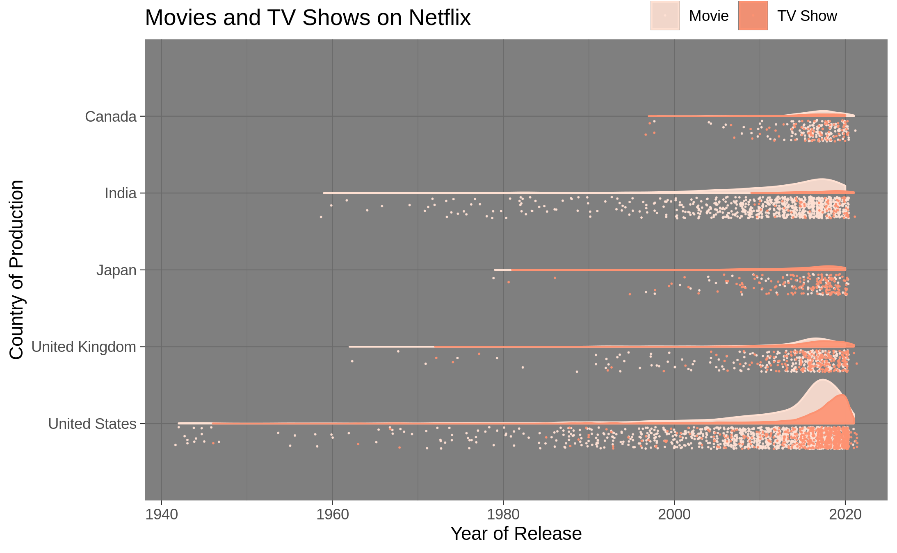
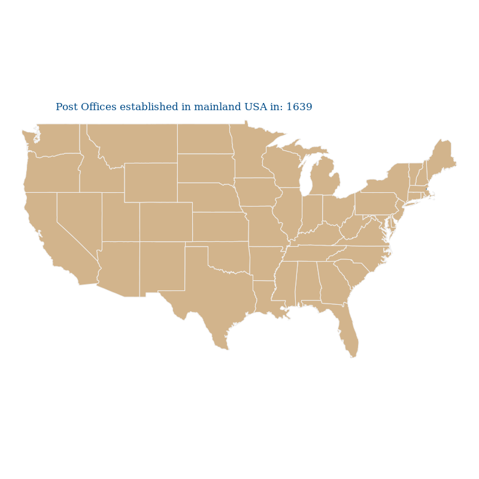
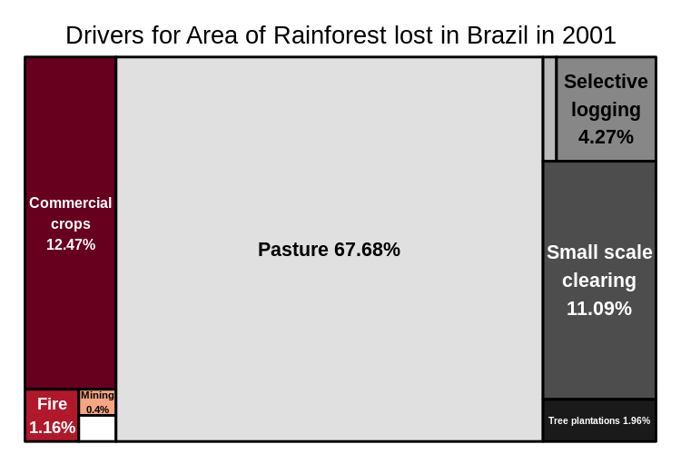

This is the repository for all of my contributions to #TidyTuesday, an initiative by the [R4DS online learning community](https://www.rfordatasci.com/). All the data and related articles can be found in the official [#TidyTuesday github repo](https://github.com/rfordatascience/tidytuesday).

Each of the folders in this repository contains some example visualizations and the code I wrote to create them. So far, I have worked on the following data sets:

## July 2021

### Week 31 - Olympics
The data this week comes from [Kaggle](https://www.kaggle.com/heesoo37/120-years-of-olympic-history-athletes-and-results?select=noc_regions.csv). It contains data on all the contenders in the Olympics from Athens 1896 to Rio 2016, including of course the great Champions who won gold, silver and bronze medals time and again. My unit chart below shows the 12 athletes who have won the highest number of gold medals over these 120 years.

## June 2021

### Week 26 - Park Access
This week's dataset was provided by [The Trust for Public Land](https://www.tpl.org/parks-and-an-equitable-recovery-parkscore-report). It contains ratings of public parks across the United States based on a number of criteria. I created a Lollipop Plot to show the ratings for the five biggest cities in the US.

Check out the code [here](https://github.com/Alessine/TidyTuesday/blob/master/2021W26_park_access/210622_tidytuesday_park_access.Rmd).

### Week 24 - Fish in the Great Lakes
This dataset comes from the [Great Lakes Fishery Commission](http://www.glfc.org/great-lakes-databases.php). I have been looking for an opportunity to create sunburst plots and this seemed like the perfect dataset for it, with its nested structure (lakes - years - fish species). Below is the static plot for Lake Erie. If I get time, I'll see if I can arrange the plots for each lake in a dashboard to get an overview, while maintaining the interactivity that plotly offers.

Check out the code [here](2021W24_Great_Lakes_fish/210608_tidytuesday_great_lakes_fish.Rmd).

## May 2021

### Week 21 - Manager Salaries
The data this week comes from the [Ask A Manager Survey](https://docs.google.com/spreadsheets/d/1IPS5dBSGtwYVbjsfbaMCYIWnOuRmJcbequohNxCyGVw/edit?resourcekey#gid=1625408792). I wanted to see the differences in salaries by age and race, so I created boxplots for all these different groups. The dataset is quite imbalanced because most of the respondents were white and female. However, it still gives some interesting insights into how these factors appear to influence the salary level.

Check out the code [here](2021W21_Ask_a_Manager/210518_tidytuesday_ask_a_manager.Rmd).

### Week 19 - Water Sources in Africa
This is a really interesting data set from [Water Point Data Exchange](https://data.waterpointdata.org/dataset/Water-Point-Data-Exchange-WPDx-Basic-/jfkt-jmqa), but I just could not find the time to work on it. Nevertheless, I quickly created this histogram to show what proportion of the installed water sources were still functional at the time of the visit. I thought it was great to see that so many of them continue to be used!

Check out the code [here](https://github.com/Alessine/TidyTuesday/blob/master/2021W19_water_sources/210504_tidytuesday_water_sources.Rmd).

## April 2021

### Week 18 - CEO Departures
This week's data set contains information on CEOs in S&P 1500 firms from the 90s through 2020. It documents their departure from the company and the reason for leaving. Credit goes to [Gentry et al.](https://onlinelibrary.wiley.com/doi/abs/10.1002/smj.3278) by way of [DataIsPlural](https://www.data-is-plural.com/archive/2021-04-21-edition/).

I created this combined plot showing different aspects in several figures. The main plot shows a regression, which was inspired by Julia Silge's TidyTuesday contribution for this week. The smaller two plots show (1) how many times each company has changed its CEO and (2) the reasons for the turnover.

Check out the code [here](https://github.com/Alessine/TidyTuesday/blob/master/2021W18_CEO_Departures/210427_tidytuesday_CEO_departures.Rmd).

### Week 17 - Netflix movies and TV shows
This week the data came from [Kaggle](https://www.kaggle.com/shivamb/netflix-shows?select=netflix_titles.csv) with credit to Shivam Bansal.

I was interested in where the movies and TV shows on Netflix come from, so I created rain cloud plots for the five countries with the highest number of movies and shows, using the gghalves library. These plots give an idea of the absolute number of data points, while also showing their distribution. Additionally, I worked on the theme to align it with Netflix branding.

Check out the code [here](https://github.com/Alessine/TidyTuesday/blob/master/2021W17_Netflix_Shows/210420_tidytuesday_netflixshows.Rmd).

### Week 16 - US Post Offices
I tried my hand at animated maps with the maps library and gganimate to show the establishment of post offices in the mainland USA between the years 1639 and 2000. The data was provided by [Cameron Blevins and Richard W. Helbock](https://dataverse.harvard.edu/dataset.xhtml?persistentId=doi:10.7910/DVN/NUKCNA).

Check out the code [here](https://github.com/Alessine/TidyTuesday/blob/master/2021W16_US_post_offices/210413_tidytuesday_uspostoffices.R).

### Week 15 - Deforestation in Brazil
I created treemaps to show the break up of forest area loss by its different drivers in the years 2001-2013. I then used the gifski library to animate the png files and compile them into one gif. The data was provided by [Our World in Data](https://ourworldindata.org/).

Check out the code [here](https://github.com/Alessine/TidyTuesday/blob/master/2021W15_Deforestation_in_Brazil/210406_tidytuesday_deforestation.Rmd).

