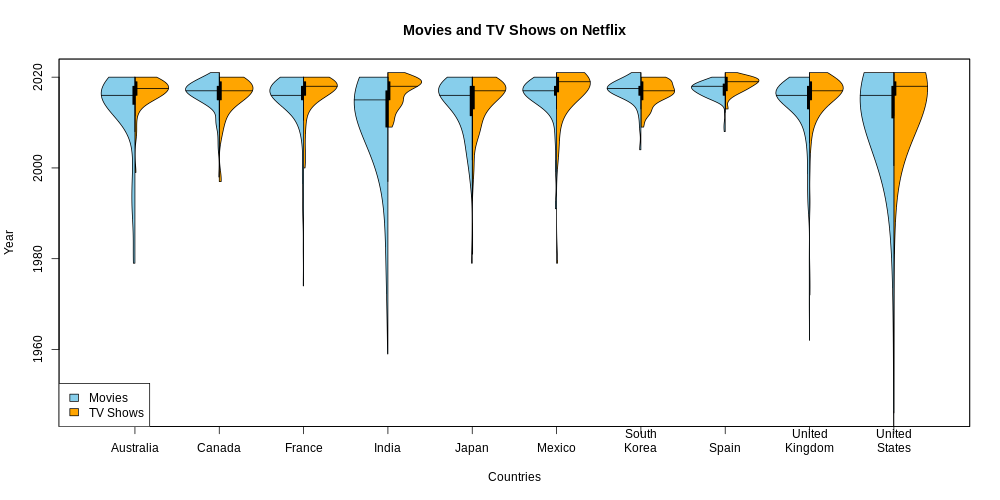

This is the repository for all of my contributions to #TidyTuesday, an initiative by the [R4DS online learning community](https://www.rfordatasci.com/). All the data and related articles can be found in the official [#TidyTuesday github repo](https://github.com/rfordatascience/tidytuesday).

Each of the folders in this repository contains some example visualizations and the code I wrote to create them. So far, I have worked on the following data sets:

## April 2021

### Week 17 - Netflix movies and TV shows
Violin plots are useful to visualize the distributions of categorical variables. So I selected the ten countries with the highest number of TV Shows and Movies on Netflix and created a split violin plot for each of them. The distributions show how the origin of movies and shows changes over the years, from mostly American productions in the 70s and 80s to a more diversified portfolio.

The data comes from [Kaggle](https://www.kaggle.com/shivamb/netflix-shows?select=netflix_titles.csv) with credit to Shivam Bansal.

### Week 16 - US Post Offices
I tried my hand at animated maps with the maps library and gganimate to show the establishment of post offices in the mainland USA between the years 1639 and 2000. The data was provided by [Cameron Blevins and Richard W. Helbock](https://dataverse.harvard.edu/dataset.xhtml?persistentId=doi:10.7910/DVN/NUKCNA).

### Week 15 - Deforestation in Brazil
I created treemaps to show the break up of forest area loss by its different drivers in the years 2001-2013. I then used the gifski library to animate the png files and compile them into one gif. The data was provided by [Our World in Data](https://ourworldindata.org/).

